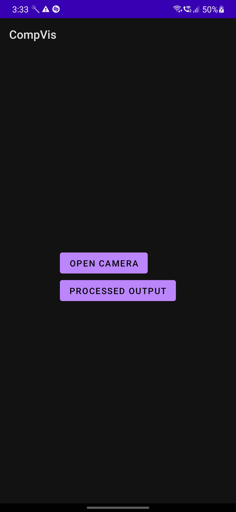
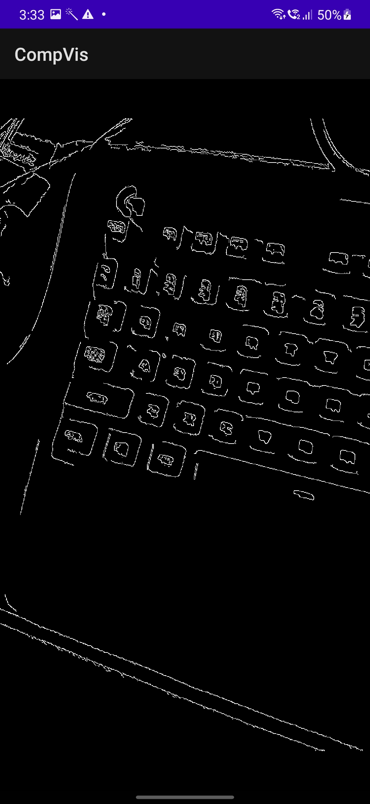

# Real-Time Edge Detection Viewer 

This is an android app that was developed in Java using OpenCV. The two options are shown when you open the app:
1. Open Camera - This shows us the regular camera view.
2. Show Processed Output - This shows us the real-time image after Canny-edge detection.

## ✅ Features Implemented

- 🔁 Real-time camera feed capture using `Camera2` and `TextureView`
- 🧠 Canny Edge Detection and Grayscale processing using **OpenCV in C++**
- 🔗 JNI bridge for Java ↔ C++ communication
- 🎨 Real-time rendering with **OpenGL ES 2.0**
- 🔘 Toggle between raw and processed frame views
- ⏱️ Frame timing logs (FPS)

## 📷 Screenshots

### &nbsp;&nbsp;&nbsp;&nbsp;&nbsp;&nbsp;&nbsp;&nbsp;&nbsp; Home Page &nbsp;&nbsp;&nbsp;&nbsp;&nbsp;&nbsp;&nbsp;&nbsp;&nbsp;&nbsp;&nbsp;&nbsp;&nbsp;&nbsp;&nbsp;&nbsp;&nbsp;&nbsp;&nbsp;&nbsp;&nbsp;&nbsp;&nbsp;&nbsp;&nbsp;&nbsp;&nbsp;&nbsp;&nbsp;&nbsp; The Raw Image &nbsp;&nbsp;&nbsp;&nbsp;&nbsp;&nbsp;&nbsp;&nbsp;&nbsp;&nbsp;&nbsp;&nbsp;&nbsp;&nbsp;&nbsp;&nbsp;&nbsp;&nbsp;&nbsp;&nbsp;&nbsp;&nbsp;&nbsp; The Processed Image
 &nbsp;&nbsp;&nbsp;&nbsp;&nbsp;&nbsp;&nbsp;&nbsp;&nbsp;&nbsp;&nbsp;&nbsp;&nbsp;&nbsp;  &nbsp;&nbsp;&nbsp;&nbsp;&nbsp;&nbsp;&nbsp;&nbsp;&nbsp;&nbsp;&nbsp; 

## ⚙️ Setup Instructions

### 1. ✅ Prerequisites

- Android Studio Arctic Fox or higher
- Android NDK (r21 or newer)
- OpenCV Android SDK (preferably version 4.x)

### 2. 📂 Clone the Repository

```bash
git clone https://github.com/namanrox/Real-Time-Edge-Detection-Viewer.git
cd Real-Time-Edge-Detection-Viewer
```

### 3. 🧰 OpenCV SDK Integration
- Download the OpenCV Android SDK
- Extract the SDK and place it in:
```bash
app/src/main/jniLibs/OpenCV/
```
- Inside CMakeLists.txt:
```bash
set(OpenCV_DIR ${CMAKE_SOURCE_DIR}/src/main/jniLibs/OpenCV/sdk/native/jni)
find_package(OpenCV REQUIRED)
```
### 4. 🏗️ Build and Run
- Enable NDK and CMake in Project Structure > SDK Tools
- Plug in your Android device or use an emulator with Camera support
- Build and run via Android Studio or:
```bash
./gradlew assembleDebug
```

## 🧠 Architecture Overview


## 🔗 Layer-wise Summary

- Java/Kotlin Layer:
  - Uses Camera2 API to stream frames into a TextureView
  - Sends each frame to native code via JNIInterface.java
- JNI Bridge:
  - Java calls processFrame(jbyteArray frame, int w, int h) in native-lib.cpp
  - JNI converts a byte array to cv::Mat, calls the OpenCV processor
- OpenCV C++ Layer:
  - Applies grayscale or Canny edge detection
  - Converts output to RGBA for OpenGL compatibility
- OpenGL Renderer:
  - Renders processed image as texture in real time
  - Ensures smooth rendering at 15+ FPS

## 📜 License
This project is licensed under the MIT License - feel free to modify and share.

## 🙌 Acknowledgments
- [OpenCV](https://opencv.org/)
- [Android Camera2 API Documentation](https://developer.android.com/reference/android/hardware/camera2/package-summary)
- [OpenGL ES](https://developer.android.com/develop/ui/views/graphics/opengl/about-opengl)
